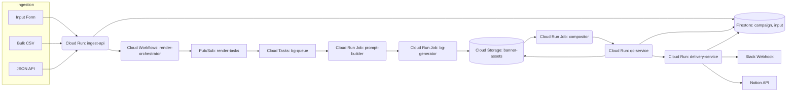

# Banner Factory Architecture

## Objectives
- Accept multi-channel campaign inputs (form/CSV/JSON) and translate them into consistent banner variants.
- Orchestrate background generation via nano banana API and compose layered creatives with HTML/CSS rendering.
- Auto-expand to multiple aspect ratios (1:1, 4:5, 1200×628, 1080×1920) while respecting safe zones and layout rules.
- Enforce QC/compliance gates (text legibility, forbidden claims, stat evidence) prior to delivery.
- Deliver final assets and metadata to Slack/Notion along with audit trails and approvals.

## High-level data flow



## Core services

### ingest-api (Cloud Run)
- REST endpoints for form/UI submissions and bulk uploads.
- Validates against shared JSON Schemas (see `packages/shared/schemas`).
- Creates `campaign` documents and enqueues Workflows executions.
- Provides `GET /campaigns/:id` for status and metadata retrieval.

### render-orchestrator (Cloud Workflows)
- Reads templates, sizes, and variant counts from request payload.
- Generates deterministic IDs (`variant_id`, `render_job_id`).
- Publishes tasks to `render-tasks` Pub/Sub for prompt + background generation.
- Implements retry/backoff policies and fallbacks (e.g., switch to stock background).

### prompt-builder (Cloud Run Job)
- Resolves template config (T1/T2/T3) and tone/style modifiers.
- Builds nano banana prompts and records prompt hash + references in Firestore `variant` documents.

### bg-generator (Cloud Run Job)
- Calls nano banana API using signed Secret Manager credentials.
- Retries up to 3 times with exponential backoff, then falls back to stock backgrounds.
- Stores background image and metadata JSON in Storage.

### compositor (Cloud Run Job)
- Uses headless Chromium (Puppeteer) + Sharp to compose final banners per size.
- Applies layout rules outlined in `docs/layouts.md` with support for badges, overlays, CTA placements, disclaimers.
- Writes outputs to Storage, updates `render_job` status.

### qc-service (Cloud Run)
- Runs text legibility checks, safe zone validation, and ensures stat claims include evidence.
- Invokes Cloud Vision OCR to detect embedded text inside background layers.
- Calls Vertex AI endpoint to score facial expressions if backgrounds contain people.
- Flags issues for manual review; supports auto-regeneration with modified tone/intensity.

### delivery-service (Cloud Run)
- Monitors Firestore for QC-passed assets (via Eventarc trigger) and posts Slack/Notion messages.
- Handles approval workflow (two :+1: reactions) before marking assets as "publishable".

## Storage layout
```
/gs://banner-assets/{brand}/{campaign_id}/{date}/
  T1-emergency-1080x1080-v01_slug.png
  T1-emergency-1200x628-v01_slug.png
  meta/T1-v01.json
  previews/T1-emergency-1080x1080-v01.jpg
```
- Metadata JSON contains input payloads, prompt text, refs hash, generation timestamps, QC report summary.

## Datastore (Firestore) schema
- `campaign`: brand, lp_url, objective, style_code, created_at, status, approvals.
- `template`: template_code, layout JSON (grid, safe zones, text styles), updated_at.
- `variant`: campaign_id, template_code, tone, prompt_hash, refs_hash, bg_asset_path.
- `render_job`: variant_id, size, status, qc_findings, retries.
- `asset`: render_job_id, storage_path, preview_url, qc_passed.
- `evidence`: stat_claim_id, url, note, verified_by, verified_at.

## Workflow resilience
- Cloud Tasks ensures idempotent job execution with dedupe keys per variant/size.
- Workflows catches errors and triggers fallback flows defined in `docs/recovery.md`.
- Alerting via Cloud Monitoring for error rate, render latency, QC failure rate.

## Security & compliance
- Cloud Armor fronting HTTPS Load Balancer to protect public endpoints.
- Service-to-service auth with IAM service accounts and Audience-limited OAuth tokens.
- Secret Manager for API keys (nano banana, Slack, Notion) with automatic rotation.
- VPC Service Controls around Storage/Firestore to prevent data exfiltration.

## Deployment pipeline
- Cloud Build triggers on main branch merges.
- Builds container images per service and pushes to Artifact Registry.
- Cloud Deploy orchestrates staged rollouts (dev → staging → prod) per environment.

## Local development
- Run individual services with `npm run dev --workspace services/<service>`.
- Use `tasks/local/` scripts to simulate Workflows/Cloud Tasks by invoking service entrypoints sequentially.
- Compose background generator results using stub fixtures to avoid hitting nano banana in dev.

